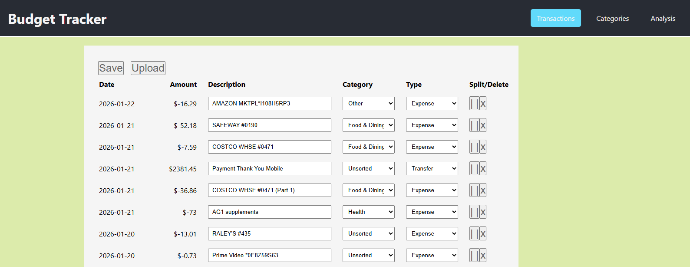

# Budget Tracker

A full-stack personal finance management application built with React, Node.js, and MongoDB. Track expenses, manage categories, and analyze spending patterns with automated CSV import and data visualization.



## Features

- **Expense Management**: CRUD operations for transactions with category assignment
- **Category Management**: Create custom spending categories with budget limits and color coding
- **Data Import**: Automated CSV processing for bank statements from multiple institutions
- **Financial Analysis**: Monthly/yearly spending reports with interactive charts and tables
- **Data Export**: Backup functionality with JSON export to local file system
- **Expense Splitting**: Split transactions across multiple categories
- **Responsive Design**: Clean, modern UI that works on desktop and mobile

## Backend

### Stack

Node.js, Express, MongoDB

### Fuctionality

Crud operations for Expenses and Categories.

# Frontend

### Stack

React, TypeScript

### Functionality

Manage transactions and categories. Analyze transaction data.

## Getting Started

### Prerequisites

- Docker Desktop
- Git

### Installation

1. **Clone the repository**

   ```bash
   git clone <repository-url>
   cd budget-tracker
   ```

2. **Start the application**

   ```bash
   docker-compose up --build
   ```

3. **Access the application**
   - **Frontend**: http://localhost:3001
   - **Backend API**: http://localhost:3000/api
   - **MongoDB**: localhost:27017

### Docker Commands

```bash
# Start all services
docker-compose up --build

# Stop all services
docker-compose down

# Stop and remove all data
docker-compose down -v

# View logs
docker-compose logs [service-name]
```

## API Endpoints

### Transactions

- `GET /api/transactions` - Get all transactions
- `POST /api/transactions` - Create transaction
- `PUT /api/transactions/:id` - Update transaction
- `DELETE /api/transactions/:id` - Delete transaction

### Categories

- `GET /api/categories` - Get all categories
- `POST /api/categories` - Create category
- `PUT /api/categories/:id` - Update category
- `DELETE /api/categories/:id` - Delete category

### File Operations

- `POST /api/uploads` - Upload CSV bank statements
- `GET /api/backup` - Get backup data
- `POST /api/backup/export` - Export data to file

## Usage

### Importing Bank Data

1. Navigate to "Upload Transactions"
2. Select your bank format (Bank1 or Bank2)
3. Upload CSV file
4. Review and confirm imported transactions

### Creating Categories

1. Go to "Categories" section
2. Click "Add Category"
3. Set name (lowercase, no spaces), display name, color, and budget limit

### Analyzing Expenses

1. Visit "Analysis" section
2. Filter by year, month, and category
3. View spending patterns in charts and detailed tables
4. Export reports for external analysis

## Project Structure

```
budget-tracker/
├── frontend/                 # React TypeScript application
│   ├── src/components/      # Reusable UI components
│   ├── src/services/        # API communication layer
│   └── public/             # Static assets
├── backend/                 # Node.js Express API
│   ├── models/             # MongoDB schemas
│   ├── controllers/        # Business logic
│   ├── routes/             # API endpoints
│   ├── services/           # Utility services
│   ├── uploads/            # CSV file storage
│   └── backups/            # Data export storage
└── docker-compose.yml      # Multi-container setup
```

## Development

### Environment Variables

Create a `.env` file in the backend directory:

```
MONGODB_URI=mongodb://mongodb:27017/budget-tracker
PORT=3000
NODE_ENV=development
```
